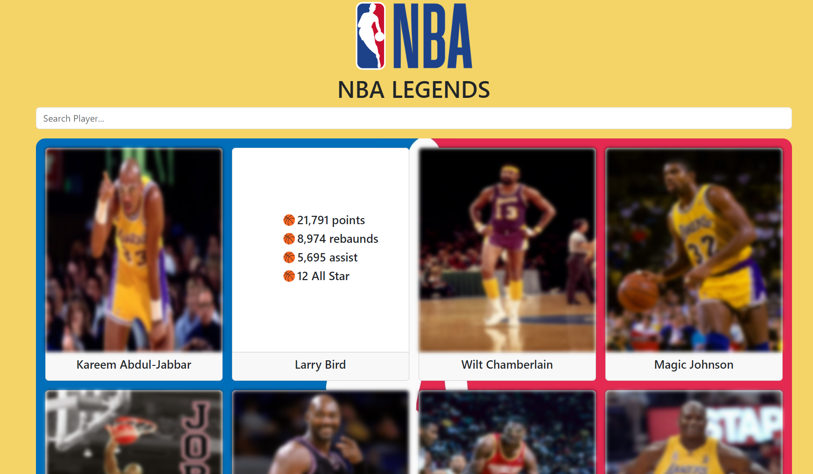

## NBA Legend App Project

## Description
This project is a react app

## Objective
At the end of the project, following topics are to be covered;
* HTML
* CSS
* JavaScript
* React

-----

### Project Skeleton:

```
    NBA_LEGEND_APP(folder)
    |
    |---- public
            |---- index.html
    |---- src
            |---- assets
                    |---- nba-logo.png
                    |---- nba.jpg
                    |---- project_view.png
            |---- compenents
                    |---- ContainerCard.jsx
                    |---- Header.jsx
                    |---- PlayerCard.jsx
            |---- helpers
                    |---- data.js
            |---- App.js
            |---- index.css                                
            |---- index.js                                   
    |---- .gitignore
    |---- package-lock.json
    |---- package.json
    |---- README.md
    |---- yarn.lock
```

### Project View Images:



> Designed By DOGUKAN © Apr. 2024